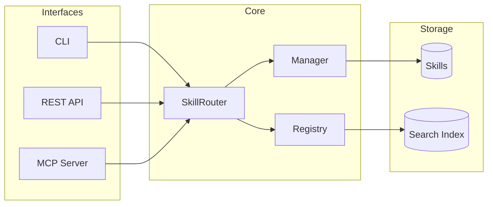

# Ai Skills


<div align="center">

[](LICENSE)
[](https://python.org)
[](https://github.com/sergioc/ai-skills)
[](https://pypi.org/project/aiskills)


**Universal AI Knowledge for Everyone**
*Write skills once. Use them with Claude, ChatGPT, Gemini, and Ollama.*

[Quick Start](#-quick-start) • [Core Concepts](#-core-concepts) • [Integrations](#-integrations) • [Architecture](#-architecture) • [Documentation](#-documentation)

</div>

---

**Ai Skills** is a local-first skills management system that serves **any large language model**. It transforms static markdown files into dynamic, semantically searchable tools that your AI agents—whether local or cloud-based—can use to solve complex problems.

## 🚀 Quick Start

Get started in seconds.

### 1. Install
```bash
pip install aiskills[all]
```
*(Recommended: Use a virtual environment or `uv tool install aiskills`)*

### 2. Initialize
Create your first skill library:
```bash
aiskills init my-first-skill
```

### 3. Search
Find skills semantically:
```bash
aiskills search "how to debug python"
# Returns specific debugging skills based on semantic meaning
```

### 4. Use Skills Naturally
Invoke skills with natural language:
```bash
aiskills use "debug python memory leak"
# Finds and displays the best matching skill automatically
```

### 5. Serve (Optional)
Start the API/MCP server to connect with apps:
```bash
aiskills api serve
```

## 💡 Core Concepts

Ai Skills is built on three simple pillars:

1.  **Skills**: Standard Markdown files with YAML frontmatter. Readable by humans, parsable by machines.
2.  **Engine**: A Python core that handles hot-reloading, template rendering, and dependency resolution.
3.  **Interfaces**: Multiple ways to access your skills—CLI, REST API, or MCP (Model Context Protocol).

## 🏗️ Architecture



### Skill Router

The **Skill Router** is the intelligent core that powers natural language skill discovery. All interfaces (CLI, REST API, MCP) use the same router, ensuring consistent behavior everywhere.

```python
from aiskills.core.router import get_router

router = get_router()
result = router.use("debug python memory leak")

print(result.skill_name)   # → "python-debugging"
print(result.score)        # → 0.89 (similarity score)
print(result.content)      # → Rendered skill content
```

**Features:**
- 🔍 **Semantic Search** with automatic fallback to text search
- 📝 **Template Variables** for dynamic skill content
- 🔄 **Multiple Results** with `limit` parameter
- ⚡ **Lazy Loading** for fast startup

### Access Methods

| Method | Command / Endpoint | Example |
|--------|-------------------|---------|
| **CLI** | `aiskills use` | `aiskills use "write unit tests"` |
| **REST API** | `POST /skills/use` | `{"context": "optimize SQL"}` |
| **MCP Tool** | `use_skill` | Called by Claude/agents |
| **Python** | `router.use()` | Direct SDK usage |

## 🔌 Integrations

Connect your skills to your favorite tools.

| Platform | Integration Method | Status | Guide |
| :--- | :--- | :--- | :--- |
| **Claude Desktop** | MCP Server | ✅ Ready | [**Setup Guide**](docs/integrations/claude_desktop.md) |
| **Google Gemini** | Function Calling | ✅ Ready | [**Gemini Guide**](docs/integrations/gemini.md) |
| **Ollama / Local** | Tool Calling / CLI | ✅ Ready | [**Ollama Guide**](docs/integrations/ollama.md) |
| **ChatGPT** | Custom GPT / Actions | ✅ Ready | [ChatGPT Guide](docs/integrations/chatgpt.md) |
| **Claude Code** | Plugin | ✅ Ready | [Plugin Guide](plugin/README.md) |
| **Custom Agents** | Python SDK | ✅ Ready | [SDK Docs](docs/sdk.md) |

## 📖 Skill Format

Skills are simple markdown files with power-packed frontmatter.

```markdown
---
name: python-expert
description: Advanced Python debugging and optimization techniques.
tags: [python, coding, debug]
dependencies:
  - name: coding-basics
    version: ">=1.0.0"
---

# Python Expert Guide

## Memory Management
Use `tracemalloc` to identify leaks...
```

## 🤝 Contributing
We welcome contributions! Please see our [Contributing Guide](CONTRIBUTING.md) for details.

## 📄 License
AGPL-3.0 © [SergioC](https://github.com/sergioc)
