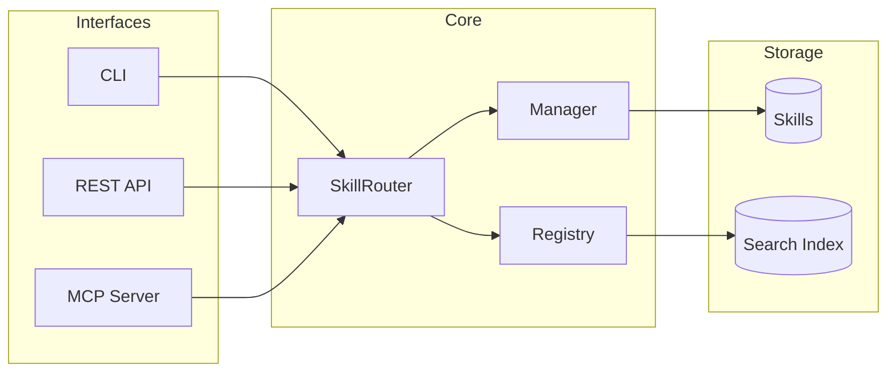

# Ai Skills


<div align="center">

[](LICENSE)
[](https://python.org)
[](https://github.com/sergioc/ai-skills)
[](https://pypi.org/project/aiskills)


**Universal AI Knowledge for Everyone**
*Write skills once. Use them with Claude, ChatGPT, Gemini, and Ollama.*

[Quick Start](#-quick-start) • [Core Concepts](#-core-concepts) • [Integrations](#-integrations) • [Architecture](#-architecture) • [Documentation](#-documentation) • [Examples](#examples--notebooks)

</div>

---

**Ai Skills** is a local-first skills management system that serves **any large language model**. It transforms static markdown files into dynamic, semantically searchable tools that your AI agents—whether local or cloud-based—can use to solve complex problems.

## 🚀 Quick Start

Get started in seconds.

### 1. Install
```bash
pip install aiskills[all]
```
*(Recommended: Use a virtual environment or `uv tool install aiskills`)*

### 2. Initialize
Create your first skill library:
```bash
aiskills init my-first-skill
```

### 3. Search
Find skills semantically:
```bash
aiskills search "how to debug python"
# Returns specific debugging skills based on semantic meaning
```

### 4. Use Skills Naturally
Invoke skills with natural language:
```bash
aiskills use "debug python memory leak"
# Finds and displays the best matching skill automatically
```

### 5. Serve (Optional)
Start the API/MCP server to connect with apps:
```bash
aiskills api serve
```

## 💡 Core Concepts

Ai Skills is built on three simple pillars:

1.  **Skills**: Standard Markdown files with YAML frontmatter. Readable by humans, parsable by machines.
2.  **Engine**: A Python core that handles hot-reloading, template rendering, and dependency resolution.
3.  **Interfaces**: Multiple ways to access your skills—CLI, REST API, or MCP (Model Context Protocol).

## 🏗️ Architecture



### Skill Router

The **Skill Router** is the intelligent core that powers natural language skill discovery. All interfaces (CLI, REST API, MCP) use the same router, ensuring consistent behavior everywhere.

```python
from aiskills.core.router import get_router

router = get_router()
result = router.use("debug python memory leak")

print(result.skill_name)   # → "python-debugging"
print(result.score)        # → 0.89 (similarity score)
print(result.content)      # → Rendered skill content
```

**Features:**
- 🔍 **Semantic Search** with automatic fallback to text search
- 📝 **Template Variables** for dynamic skill content
- 🔄 **Multiple Results** with `limit` parameter
- ⚡ **Lazy Loading** for fast startup

### Access Methods

| Method | Command / Endpoint | Example |
|--------|-------------------|---------|
| **CLI** | `aiskills use` | `aiskills use "write unit tests"` |
| **REST API** | `POST /skills/use` | `{"context": "optimize SQL"}` |
| **MCP Tool** | `use_skill` | Called by Claude/agents |
| **Python** | `router.use()` | Direct SDK usage |

## 🔌 Integrations

Connect your skills to your favorite LLMs with just 3 lines of code.

### Quick Start (SDK Wrappers)

```bash
# Install with your preferred provider
pip install aiskills[openai]     # OpenAI/ChatGPT
pip install aiskills[anthropic]  # Claude API
pip install aiskills[gemini]     # Google Gemini
pip install aiskills[ollama]     # Local LLMs
pip install aiskills[llms]       # All providers
```

```python
# OpenAI
from aiskills.integrations import create_openai_client
client = create_openai_client()
response = client.chat("Help me debug this memory leak")

# Anthropic Claude
from aiskills.integrations import create_anthropic_client
client = create_anthropic_client()
response = client.chat("How do I write better tests?")

# Google Gemini
from aiskills.integrations import create_gemini_client
client = create_gemini_client()
response = client.chat("Optimize my SQL queries")

# Ollama (local)
from aiskills.integrations import create_ollama_client
client = create_ollama_client(model="llama3.1")
response = client.chat("Explain async patterns")
```

### Platform Support

| Platform | SDK Wrapper | REST API | Native Protocol | Guide |
| :--- | :--- | :--- | :--- | :--- |
| **OpenAI / ChatGPT** | `create_openai_client()` | ✅ | - | [Guide](docs/integrations/chatgpt.md) |
| **Anthropic Claude** | `create_anthropic_client()` | ✅ | - | [Guide](docs/integrations/anthropic.md) |
| **Google Gemini** | `create_gemini_client()` | ✅ | - | [Guide](docs/integrations/gemini.md) |
| **Ollama / Local** | `create_ollama_client()` | ✅ | - | [Guide](docs/integrations/ollama.md) |
| **Claude Desktop** | - | - | MCP Server | [Guide](docs/integrations/claude_desktop.md) |
| **Claude Code** | - | - | Plugin + MCP | [Guide](plugin/README.md) |

### CLI Integration Testing

```bash
# Check which integrations are available
aiskills llm status

# Test each provider
aiskills llm openai "What skills do you have?"
aiskills llm anthropic "Help me with testing"
aiskills llm gemini "Explain caching strategies"
aiskills llm ollama "Debug my Python code"

# List local Ollama models
aiskills llm list-models
```

## 📖 Skill Format

Skills are simple markdown files with power-packed frontmatter.

```markdown
---
name: python-expert
description: Advanced Python debugging and optimization techniques.
tags: [python, coding, debug]
dependencies:
  - name: coding-basics
    version: ">=1.0.0"
---

# Python Expert Guide

## Memory Management
Use `tracemalloc` to identify leaks...
```

## 📚 Documentation

### Progressive Disclosure

Ai Skills implements a **3-phase progressive disclosure** system that optimizes context window usage:

```
Phase 1: BROWSE    →    Phase 2: LOAD    →    Phase 3: USE
(metadata only)         (full content)        (extra resources)
```

- **Browse** (`aiskills browse`): Returns lightweight metadata (name, description, `tokens_est`) without loading content. Perfect for discovering relevant skills before committing tokens.
- **Load** (`aiskills use`): Fetches the full rendered skill content.
- **Use** (on-demand): Load additional resources (templates, references, scripts) only when needed.

📖 [Full Guide](docs/progressive-disclosure.md)

### Declarative Scoping

Go beyond semantic search with **explicit matching rules** that reduce false positives:

```yaml
scope:
  paths: ["src/api/**", "migrations/**"]    # Only match when touching these files
  languages: [python, sql]                   # Only match for these languages
  triggers: [migrate, alembic, revision]     # Hard keywords that boost this skill

priority: 75              # 0-100, higher = more preferred
precedence: repository    # organization > repository > project > user > local
```

The router combines semantic similarity with scope matching for accurate skill selection.

📖 [Full Guide](docs/scoping.md)

### Local Overrides

Customize shared skills without modifying the original using `SKILL.local.md`:

```
my-skill/
├── SKILL.md           # Shared/versioned (in git)
└── SKILL.local.md     # Private overrides (gitignored)
```

Local overrides can:
- **Override** scalars (priority, precedence)
- **Extend** lists (tags, includes)
- **Deep merge** objects (scope, security, variables)
- **Append** content (add team-specific sections)

📖 [Full Guide](docs/local-overrides.md)

### Security & Sandboxing

Control what resources skills can access with the `security` policy:

```yaml
security:
  allowed_resources: [references, templates]  # What can be loaded
  allow_execution: false                      # Can scripts run?
  sandbox_level: standard                     # strict | standard | permissive
  allowlist: [deploy.sh, validate.py]         # Specific allowed scripts
```

Resources are tagged with `requires_execution` and `allowed` flags for agent decision-making.

📖 [Full Guide](docs/security.md)

### Skill Composition

Reuse content without duplication using `@include`:

```markdown
# My Guide

## Python Section
@include python-debugging

## Common Patterns
@include snippets/patterns.md
```

Features:
- Include other skills: `@include skill:name`
- Include snippets: `@include path/to/file.md`
- **Depth limit** (5) prevents infinite loops
- **Cycle detection** prevents circular includes

📖 [Full Guide](docs/includes.md)

### Multi-LLM Testing

Ai Skills includes comprehensive **acceptance tests** to validate consistent behavior across providers:

```bash
# Run all multi-LLM acceptance tests
pytest tests/integration/test_multi_llm.py -v

# Test specific providers
pytest tests/integration/test_multi_llm.py::TestClaudeMCPIntegration -v
pytest tests/integration/test_multi_llm.py::TestOpenAIFunctionCalling -v
pytest tests/integration/test_multi_llm.py::TestGeminiFunctionCalling -v
pytest tests/integration/test_multi_llm.py::TestOllamaLocalIntegration -v
```

Cross-provider tests ensure:
- All providers list the same skills
- Content is identical across providers
- Template variables render consistently
- Error handling is uniform
- No provider-specific bias in skill behavior

📖 [Full Guide](docs/testing/multi-llm.md)

### Examples & Notebooks

Ready-to-run examples for all supported providers:

```bash
# Install for your provider
pip install aiskills[llms]  # All providers
pip install jupyter         # For notebooks
```

| Resource | Description |
|----------|-------------|
| [**Examples README**](examples/README.md) | Setup guide, code samples, troubleshooting |
| [**Provider Comparison**](docs/provider-comparison.md) | Feature matrix, costs, when to use each |
| [**OpenAI Notebook**](examples/notebooks/openai_quickstart.ipynb) | GPT-4 with function calling |
| [**Anthropic Notebook**](examples/notebooks/anthropic_claude.ipynb) | Claude 3.5 with tool use |
| [**Gemini Notebook**](examples/notebooks/gemini_colab.ipynb) | Gemini with auto function calling |
| [**Ollama Notebook**](examples/notebooks/ollama_local.ipynb) | Local llama3.1 with tools |
| [**Multi-Provider Script**](examples/multi_provider.py) | Fallback chains, parallel queries |

**Quick example:**
```python
from aiskills.integrations import create_openai_client

client = create_openai_client(auto_execute=True, max_tool_rounds=5)
response = client.chat("Help me debug a Python memory leak")
print(response)  # Includes skill content automatically
```

### API Reference

| Phase | Endpoint | Description |
|-------|----------|-------------|
| Browse | `POST /skills/browse` | Metadata only (lightweight discovery) |
| Load | `POST /skills/use` | Full rendered content |
| Resources | `GET /skills/{name}/resources` | List available extras |
| Resource | `POST /skills/resource` | Load specific resource |

All endpoints support scoping context (`active_paths`, `languages`) for accurate matching.

## 🤝 Contributing
We welcome contributions! Please see our [Contributing Guide](CONTRIBUTING.md) for details.

## 📄 License
AGPL-3.0 © [SergioC](https://github.com/sergioc)
