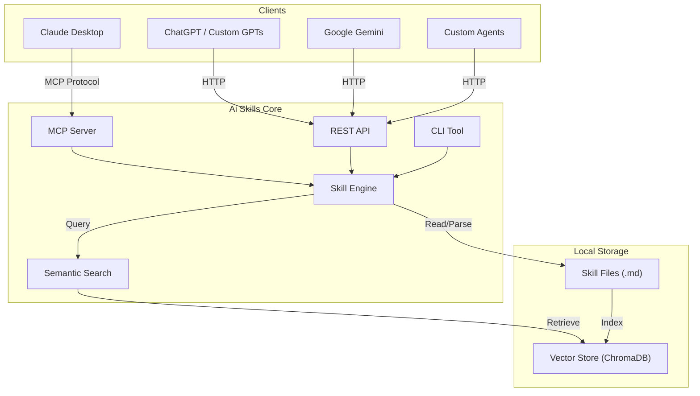

# Ai Skills


<div align="center">

[](LICENSE)
[](https://python.org)
[](https://github.com/sergioc/ai-skills)
[](https://pypi.org/project/aiskills)

**Universal AI Knowledge for Everyone**
*Write skills once. Use them with Claude, ChatGPT, Gemini, and Ollama.*

[Quick Start](#quick-start) • [Why Ai Skills](#-why-ai-skills) • [Architecture](#-architecture) • [Documentation](#-documentation) • [Contributing](#-contributing)

</div>

---

**Ai Skills** is a local-first skills management system that serves **any large language model**. It transforms static markdown files into dynamic, semantically searchable tools that your AI agents can use to solve complex problems.

## 🚀 Quick Start

Get started in seconds.

1. **Install**
   ```bash
   pip install aiskills[all]
   ```

2. **Initialize**
   ```bash
   aiskills init my-first-skill
   ```

3. **Search**
   ```bash
   aiskills search "how to debug python"
   # Returns specific debugging skills based on semantic meaning
   ```

## ✨ Why Ai Skills?

*   **🌍 Universal Compatibility** – One skill library for Claude, ChatGPT, Gemini, and local LLMs. Stop rewriting prompts.
*   **🧠 Semantic Intelligence** – Find the right skill by meaning, not just keywords. "Fix error" finds `debugging.md`.
*   **🔌 Plug-and-Play** – Works as an MCP Server for Claude Desktop, an API for custom agents, or a CLI tool.
*   **🔒 Local & Private** – Your knowledge base stays on your disk. No cloud vector DBs required.
*   **🧩 Composable** – Skills can import other skills, enforcing DRY (Don't Repeat Yourself) for AI prompts.

## 🏗️ Architecture

Ai Skills sits between your AI clients and your knowledge base, ensuring the right context is delivered every time.



## 🛠️ Integrations

| Platform | Integration Method | Status | Guide |
| :--- | :--- | :--- | :--- |
| **Claude Desktop** | MCP Server | ✅ Ready | [Setup Guide](#mcp-server-claude-desktop) |
| **ChatGPT** | REST API (OpenAI Spec) | ✅ Ready | [ChatGPT Guide](docs/integrations/chatgpt.md) |
| **Claude Code** | Plugin | ✅ Ready | [Plugin Guide](plugin/README.md) |
| **Custom Agents** | Python SDK / CLI | ✅ Ready | [SDK Docs](docs/sdk.md) |

### MCP Server (Claude Desktop)
Add this to your `claude_desktop_config.json`:
```json
{
  "mcpServers": {
    "aiskills": {
      "command": "aiskills",
      "args": ["mcp", "serve"]
    }
  }
}
```

## 📖 Skill Format
Skills are simple markdown files with power-packed frontmatter.

```markdown
---
name: python-expert
description: Advanced Python debugging and optimization techniques.
tags: [python, coding, debug]
dependencies:
  - name: coding-basics
    version: ">=1.0.0"
---

# Python Expert Guide

## Memory Management
Use `tracemalloc` to identify leaks...
```

## 🤝 Contributing
We welcome contributions! Please see our [Contributing Guide](CONTRIBUTING.md) for details.

## 📄 License
AGPL-3.0 © [SergioC](https://github.com/sergioc)
