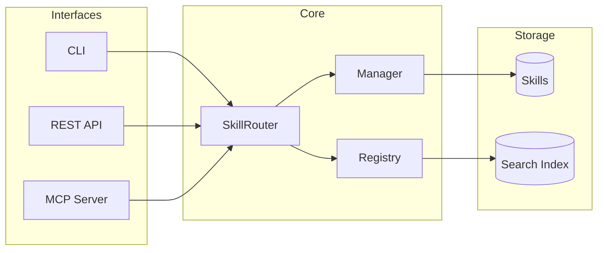

# Ai Skills


<div align="center">

[](LICENSE)
[](https://python.org)
[](https://github.com/hyukudan/ai-skills)
[](https://pypi.org/project/aiskills)


**Universal AI Knowledge for Everyone**
*Write skills once, use them everywhere.*

[Quick Start](#-quick-start) • [Core Concepts](#-core-concepts) • [Integrations](#-integrations) • [Architecture](#-architecture) • [Documentation](#-documentation) • [Examples](#examples--notebooks)

</div>

---

**Ai Skills** is a local-first skills management system that serves **any large language model**. It transforms static markdown files into dynamic, semantically searchable tools that your AI agents—whether local or cloud-based—can use to solve complex problems.

## 🚀 Quick Start

### Universal Setup (Claude, Gemini, Codex)

One script to configure AI Skills for any supported CLI:

```bash
git clone https://github.com/hyukudan/ai-skills.git
cd ai-skills
./scripts/setup.sh
```

The script will:
1. Detect installed CLIs (Claude Code, Gemini CLI, Codex CLI)
2. Let you choose which to configure
3. Install skills and build the search index
4. Configure MCP servers automatically

**Or specify CLIs directly:**
```bash
./scripts/setup.sh --claude           # Claude Code only
./scripts/setup.sh --gemini           # Gemini CLI only
./scripts/setup.sh --all              # All installed CLIs
```

Restart your CLI, then try:
- **Claude Code:** `/mcp` to verify, then "best practices for API design?"
- **Gemini CLI:** `gemini mcp list` to verify, then "what skills do you have?"
- **Codex CLI:** `codex mcp list` to verify, then "help me write tests"

### Manual / Other LLMs

```bash
pip install aiskills[all]

# Search skills semantically
aiskills search "how to debug python"

# Use a skill
aiskills use "debug python memory leak"

# Start servers
aiskills mcp serve    # MCP for Claude/Gemini/Codex
aiskills api serve    # REST API for any LLM
```

## 🤔 Why AI Skills?

You might wonder: *"Claude has its own Skills marketplace. Cursor has rules. Why use AI Skills?"*

Great question. Here's the problem: **every AI platform has its own skills format, and none of them are portable.**

### The Vendor Lock-in Problem

```
Today's reality: Each platform has its own skills ecosystem

┌─────────────┐  ┌─────────────┐  ┌─────────────┐  ┌─────────────┐
│   Claude    │  │   Cursor    │  │   Codex     │  │   Gemini    │
│   Skills    │  │   Rules     │  │   AGENTS.md │  │   Prompts   │
│ Marketplace │  │   Library   │  │   + Skills  │  │   (coming)  │
└─────────────┘  └─────────────┘  └─────────────┘  └─────────────┘
       │                │                │                │
       ▼                ▼                ▼                ▼
   Only Claude      Only Cursor      Only Codex      Only Gemini
```

**The challenges:**
- 🔒 Your expertise lives in one vendor's ecosystem
- 📝 Want the same skill on Gemini? Export and adapt it
- 🔍 Many skills? Hard to find the right one (no semantic search)
- 🤷 Similar skills? Platform decides, not you
- 🔄 Updates don't sync across platforms

### The AI Skills Solution

```
With AI Skills: One knowledge base, every AI tool

~/.aiskills/skills/
├── api-design/
├── python-debugging/
├── react-patterns/
└── ...your expertise (YOU own it)

              │
              ▼ MCP Protocol (open standard)
              │
    ┌─────────┼─────────┬───────────┬───────────┐
    │         │         │           │           │
    ▼         ▼         ▼           ▼           ▼
┌───────┐ ┌───────┐ ┌───────┐ ┌─────────┐ ┌────────┐
│Claude │ │Gemini │ │Codex  │ │ Cursor  │ │ Ollama │
│ Code  │ │  CLI  │ │  CLI  │ │   IDE   │ │ Local  │
└───────┘ └───────┘ └───────┘ └─────────┘ └────────┘

Write once. Use everywhere. You own your knowledge.
```

### AI Skills vs Platform-Specific Skills

Both Claude Skills and AI Skills use **progressive disclosure** (load on-demand, not everything at once). The differences are in discovery and portability:

| Aspect | Claude Skills / Cursor Rules / etc. | AI Skills |
|--------|-------------------------------------|-----------|
| **Works on** | Designed for one platform | Any LLM with MCP or REST |
| **Loading** | On-demand | On-demand (same) |
| **Portability** | Manual export/adapt | Automatic (same skill everywhere) |
| **Discovery (few skills)** | Works fine | Works fine |
| **Discovery (many skills)** | List/browse, platform picks | Semantic search, you choose |
| **Ambiguity handling** | Platform decides for you | Asks which skill you want |
| **Customization** | Fork and edit | Variables + `.local.md` overrides |
| **Offline** | Requires platform connection | Fully offline (local embeddings) |
| **Open Source** | Varies | Yes, AGPL-3.0 |

> **Note:** Claude Skills are well-designed. The difference shows at scale: with 50+ skills across multiple tools, semantic search and automatic portability become essential.

### Why This Matters

<details>
<summary><b>🔮 Future-Proof Your Knowledge</b></summary>

Today you use Claude. Tomorrow Gemini might be better for your use case. Next month a new AI tool emerges.

With platform-specific skills, you're starting over each time.
With AI Skills, you just run `./setup.sh --gemini` and keep working.

```
Your skills travel with you, not with the vendor.
```

</details>

<details>
<summary><b>🔍 Semantic Search at Scale</b></summary>

With 5 skills, you remember what each does. With 50+, you need search:

```
Platform skills: Browse a list, read descriptions, hope you pick right

AI Skills: "help me optimize database queries"
    → Hybrid search (semantic + keywords)
    → Finds: database-optimization (0.87), caching-strategies (0.72)
    → Asks you if scores are close: "Which one do you want?"
```

The more skills you have, the more this matters.

</details>

<details>
<summary><b>🔧 True Customization</b></summary>

Platform skills: "Fork it and maintain your own copy"

AI Skills: Local overrides without forking

```
my-skill/
├── SKILL.md          ← Original (auto-updates)
└── SKILL.local.md    ← Your customizations (gitignored)
```

The original updates, your customizations persist.

</details>

### When to Use What

| Use Case | Recommendation |
|----------|---------------|
| Project-specific rules (formatting, conventions) | Native (`CLAUDE.md`, `.cursorrules`) |
| Single platform, no plans to switch | Platform skills (Claude Skills, etc.) |
| Reusable knowledge across projects | **AI Skills** |
| Team-shared expertise | **AI Skills** (with local overrides) |
| Multi-LLM workflow | **AI Skills** (portability) |
| You want to own your knowledge | **AI Skills** |

**Bottom line:** Platform skills are fine if you're committed to one vendor. AI Skills if you want portability, ownership, and freedom.

---

## 💡 Core Concepts

Ai Skills is built on three simple pillars:

1.  **Skills**: Standard Markdown files with YAML frontmatter. Readable by humans, parsable by machines.
2.  **Engine**: A Python core that handles hot-reloading, template rendering, and dependency resolution.
3.  **Interfaces**: Multiple ways to access your skills—CLI, REST API, or MCP (Model Context Protocol).

## 🏗️ Architecture



### Skill Router

The **Skill Router** is the intelligent core that powers natural language skill discovery. All interfaces (CLI, REST API, MCP) use the same router, ensuring consistent behavior everywhere.

```python
from aiskills.core.router import get_router

router = get_router()
result = router.use("debug python memory leak")

print(result.skill_name)   # → "python-debugging"
print(result.score)        # → 0.89 (similarity score)
print(result.content)      # → Rendered skill content
```

**Features:**
- 🔍 **Hybrid Search** (semantic + BM25) for accurate matching
- 📝 **Template Variables** for dynamic skill content
- 🔄 **Multiple Results** with `limit` parameter
- ⚡ **Lazy Loading** for fast startup
- 🤔 **Ambiguous Detection** - asks when multiple skills match similarly

### Ambiguous Match Detection

When multiple skills have similar relevance scores, the router returns candidates instead of picking arbitrarily:

```python
result = router.use("help with javascript")

if result.ambiguous:
    # Multiple skills matched with similar scores
    print("Which skill do you want?")
    for c in result.candidates:
        print(f"  - {c.name}: {c.description} ({c.score:.0%})")

    # Then load the chosen one
    result = router.use_by_name("javascript-debugging")
else:
    print(result.content)
```

MCP clients (like Claude Code) will receive candidates and can ask the user which skill they prefer:
```json
{
  "ambiguous": true,
  "candidates": [
    {"name": "javascript-debugging", "score": 0.82, "description": "..."},
    {"name": "nodejs-development", "score": 0.79, "description": "..."}
  ],
  "hint": "Use skill_read with the chosen skill name"
}
```

Set `auto_select=true` to always pick the best match without asking.

### Hybrid Search Engine

AI Skills combines two search methods for best results:

| Method | How it works | Example |
|--------|--------------|---------|
| **Semantic** | Embeddings understand meaning | "make db faster" → finds `database-optimization` |
| **BM25** | Text matching for precision | "pytest" → finds `testing-patterns` |
| **Hybrid** | RRF combines both scores | Best of both worlds |

```
Query: "how to make my database faster"
       ↓
┌─────────────────┐     ┌─────────────────┐
│ Semantic Search │     │   BM25 Search   │
│  (embeddings)   │     │   (keywords)    │
└────────┬────────┘     └────────┬────────┘
         │                       │
         └───────────┬───────────┘
                     ↓
          ┌─────────────────────┐
          │ Reciprocal Rank     │
          │ Fusion (RRF)        │
          └──────────┬──────────┘
                     ↓
         database-optimization (68%)
         performance-optimization (64%)
         caching-strategies (61%)
```

- **Local embeddings** via FastEmbed (no API calls)
- **Offline-first** - works without internet
- **Auto-fallback** to text search if embeddings unavailable

### Token Optimization

Every token counts when working with LLMs. AI Skills optimizes responses at each phase:

| Operation | Returns | Omits | Why |
|-----------|---------|-------|-----|
| **Search** | `name`, `description`, `category`, `score` | `tags`, `version` | Minimal data for decision-making |
| **Read** | Full content + all metadata | - | Complete info when you need it |
| **Browse** | Metadata + `tokens_est` | Content | Discover before loading |

**Scores explained:**
- `score` in results is the **semantic similarity** (0-1) - how well the query matches the skill
- Internal ranking uses a **combined score** (semantic + priority + scope) but this is not exposed
- This keeps scores interpretable: 0.89 means "89% similar to your query"

```
Search: "debug python" → [{name: "python-debugging", score: 0.89, ...}]
                          ↑ Just 3 fields, no tags/version bloat

Read: "python-debugging" → {content: "...", metadata: {tags, version, ...}}
                           ↑ Full details when you actually need them
```

### Access Methods

| Method | Command / Endpoint | Example |
|--------|-------------------|---------|
| **CLI** | `aiskills use` | `aiskills use "write unit tests"` |
| **REST API** | `POST /skills/use` | `{"context": "optimize SQL"}` |
| **MCP Tool** | `use_skill` | Called by Claude/agents |
| **Python** | `router.use()` | Direct SDK usage |

## 🔌 Integrations

Connect your skills to your favorite LLMs with just 3 lines of code.

### Quick Start (SDK Wrappers)

```bash
# Install with your preferred provider
pip install aiskills[openai]     # OpenAI/ChatGPT
pip install aiskills[anthropic]  # Claude API
pip install aiskills[gemini]     # Google Gemini
pip install aiskills[ollama]     # Local LLMs
pip install aiskills[llms]       # All providers
```

```python
# OpenAI
from aiskills.integrations import create_openai_client
client = create_openai_client()
response = client.chat("Help me debug this memory leak")

# Anthropic Claude
from aiskills.integrations import create_anthropic_client
client = create_anthropic_client()
response = client.chat("How do I write better tests?")

# Google Gemini
from aiskills.integrations import create_gemini_client
client = create_gemini_client()
response = client.chat("Optimize my SQL queries")

# Ollama (local)
from aiskills.integrations import create_ollama_client
client = create_ollama_client(model="llama3.1")
response = client.chat("Explain async patterns")
```

### Platform Support

| Platform | SDK Wrapper | REST API | Native Protocol | Guide |
| :--- | :--- | :--- | :--- | :--- |
| **OpenAI / ChatGPT** | `create_openai_client()` | ✅ | - | [Guide](docs/integrations/chatgpt.md) |
| **Anthropic Claude** | `create_anthropic_client()` | ✅ | - | [Guide](docs/integrations/anthropic.md) |
| **Google Gemini** | `create_gemini_client()` | ✅ | - | [Guide](docs/integrations/gemini.md) |
| **Local LLMs (Ollama)** | `create_ollama_client()` | ✅ | - | [Guide](docs/integrations/ollama.md) |
| **Claude Desktop** | - | - | MCP Server | [Guide](docs/integrations/claude_desktop.md) |
| **Claude Code** | - | - | Plugin + MCP | [Guide](plugin/README.md) |

### Token Optimization (MCP)

The MCP server is optimized to **avoid unnecessary API calls**. Claude only uses skills when you explicitly ask for:

| Trigger | Example |
|---------|---------|
| Best practices | "what are best practices for API design?" |
| Design patterns | "show me authentication patterns" |
| Architectural guidance | "how should I structure this service?" |
| Explicit skill requests | "list skills", "search skills about testing" |

Claude will **not** call skills for simple questions like "how do I write a for loop" - this saves tokens and keeps responses fast.

### CLI Integration Testing

```bash
# Check which integrations are available
aiskills llm status

# Test each provider
aiskills llm openai "What skills do you have?"
aiskills llm anthropic "Help me with testing"
aiskills llm gemini "Explain caching strategies"
aiskills llm ollama "Debug my Python code"

# List local Ollama models
aiskills llm list-models
```

## 📦 Bundled Skills

Ai Skills ships with **50+ ready-to-use skills**: 23 marketing/growth skills and 31 development skills. Install them globally to make them available across all your projects:

```bash
# Install all bundled skills
aiskills install examples/skills/ --global

# Or install specific skills
aiskills install examples/skills/page-cro --global
```

### Marketing Skills Library

<details>
<summary><b>🎯 Conversion Rate Optimization (6 skills)</b></summary>

| Skill | What it does |
|-------|-------------|
| `page-cro` | Analyze and optimize landing pages for conversion. Value propositions, headlines, CTAs, visual hierarchy, trust signals. |
| `signup-flow-cro` | Reduce signup friction and increase completion rates. Field optimization, single vs multi-step, social auth. |
| `onboarding-cro` | Optimize user activation and first-run experience. Checklists, empty states, product tours, engagement loops. |
| `form-cro` | Maximize form completion rates. Field strategy, layout, validation, mobile optimization. |
| `popup-cro` | Create high-converting popups without annoying users. Exit intent, triggers, timing, frequency capping. |
| `paywall-upgrade-cro` | Convert free users to paid. Feature gates, usage limits, trial flows, upgrade psychology. |

```bash
aiskills use "optimize my pricing page for conversions"
aiskills use "reduce signup form abandonment"
aiskills use "design an exit-intent popup"
```
</details>

<details>
<summary><b>✍️ Content & Copywriting (4 skills)</b></summary>

| Skill | What it does |
|-------|-------------|
| `copywriting` | Write marketing copy that converts. Headlines, CTAs, page structure, voice guidelines. |
| `copy-editing` | Systematically improve existing copy. The Seven Sweeps: Clarity, Voice, So What, Prove It, Specificity, Emotion, Risk. |
| `email-sequence` | Design email sequences and drip campaigns. Welcome, nurture, re-engagement, onboarding, billing emails. |
| `social-content` | Create engaging social media content. Platform strategies, post templates, hooks, repurposing systems. |

```bash
aiskills use "write a compelling headline for my SaaS"
aiskills use "create a 7-email welcome sequence"
aiskills use "write a LinkedIn post about our launch"
```
</details>

<details>
<summary><b>🔍 SEO (4 skills)</b></summary>

| Skill | What it does |
|-------|-------------|
| `seo-audit` | Audit websites for SEO issues. Crawlability, indexation, Core Web Vitals, on-page optimization, E-E-A-T. |
| `programmatic-seo` | Build SEO pages at scale. The 12 pSEO playbooks: templates, comparisons, locations, integrations, glossary. |
| `schema-markup` | Implement structured data for rich results. JSON-LD examples for Organization, Article, Product, FAQ, HowTo. |
| `competitor-alternatives` | Create comparison and alternative pages. "[X] vs [Y]" pages, "[X] alternatives" pages, competitor positioning. |

```bash
aiskills use "audit my site for technical SEO issues"
aiskills use "implement FAQ schema markup"
aiskills use "create a competitor comparison page"
```
</details>

<details>
<summary><b>📊 Ads & Analytics (3 skills)</b></summary>

| Skill | What it does |
|-------|-------------|
| `paid-ads` | Create and optimize paid campaigns. Google, Meta, LinkedIn. Targeting, creative, bidding, retargeting. |
| `analytics-tracking` | Set up analytics that inform decisions. GA4, GTM, event design, UTM strategy, tracking plans. |
| `ab-test-setup` | Design statistically valid A/B tests. Hypothesis framework, sample size, metrics selection, analysis. |

```bash
aiskills use "set up Google Ads for my B2B SaaS"
aiskills use "design an A/B test for my checkout flow"
aiskills use "create a GA4 tracking plan"
```
</details>

<details>
<summary><b>🚀 Growth & Strategy (6 skills)</b></summary>

| Skill | What it does |
|-------|-------------|
| `pricing-strategy` | Design pricing that maximizes revenue. Value metrics, tier design, anchoring, pricing pages. |
| `launch-strategy` | Plan and execute product launches. Pre-launch, launch day, post-launch playbooks. |
| `referral-program` | Build referral and affiliate programs. Viral loops, incentive structures, program mechanics. |
| `free-tool-strategy` | Use engineering as marketing. Free tools, calculators, APIs that drive organic growth. |
| `marketing-ideas` | Library of marketing tactics. Channel strategies, growth levers, campaign ideas by stage. |
| `marketing-psychology` | Apply behavioral science to marketing. Cognitive biases, persuasion principles, decision psychology. |

```bash
aiskills use "design a freemium pricing model"
aiskills use "plan a Product Hunt launch"
aiskills use "create a referral program for my app"
```
</details>

### Development Skills Library

<details>
<summary><b>🏗️ Backend & Architecture (8 skills)</b></summary>

| Skill | What it does |
|-------|-------------|
| `api-design` | Design RESTful and GraphQL APIs. Versioning, error handling, pagination, authentication patterns. |
| `architecture-patterns` | Software architecture patterns. Microservices, monoliths, event-driven, hexagonal architecture. |
| `async-concurrency` | Async programming patterns. Event loops, coroutines, parallel execution, race conditions. |
| `caching-strategies` | Implement caching effectively. Redis, in-memory, CDN, cache invalidation strategies. |
| `database-design` | Database schema design. Normalization, indexing, relationships, migrations. |
| `database-optimization` | Database performance. Cursor pagination, N+1 queries, connection pooling, slow query diagnosis. |
| `error-handling` | Robust error handling patterns. Exceptions, retries, circuit breakers, graceful degradation. |
| `performance-optimization` | Application performance. Profiling, bottleneck identification, memory optimization. |

```bash
aiskills use "design a REST API with pagination"
aiskills use "cursor pagination vs offset"
aiskills use "fix N+1 query problem"
```
</details>

<details>
<summary><b>🧪 Testing & Quality (3 skills)</b></summary>

| Skill | What it does |
|-------|-------------|
| `testing-strategies` | Testing approaches. Unit, integration, e2e testing, TDD, coverage strategies. |
| `testing-patterns` | Advanced testing patterns. Mocking, fixtures, parameterized tests, test isolation. |
| `code-review` | Effective code reviews. Review checklists, feedback patterns, automated checks. |

```bash
aiskills use "write unit tests for async code"
aiskills use "set up pytest fixtures"
aiskills use "code review best practices"
```
</details>

<details>
<summary><b>🚀 DevOps & Infrastructure (5 skills)</b></summary>

| Skill | What it does |
|-------|-------------|
| `ci-cd-pipelines` | CI/CD setup. GitHub Actions, GitLab CI, Jenkins, deployment automation. |
| `docker-deployment` | Docker for production. Multi-stage builds, compose, health checks, optimization. |
| `docker-kubernetes` | Kubernetes orchestration. Deployments, services, ingress, helm charts. |
| `logging-observability` | Observability stack. Structured logging, metrics, tracing, alerting. |
| `incident-response` | Handle production incidents. Runbooks, postmortems, on-call practices. |

```bash
aiskills use "set up GitHub Actions CI/CD"
aiskills use "dockerize a Python application"
aiskills use "kubernetes deployment patterns"
```
</details>

<details>
<summary><b>🔒 Security (3 skills)</b></summary>

| Skill | What it does |
|-------|-------------|
| `authentication-patterns` | Auth implementation. JWT, OAuth, sessions, MFA, password hashing. |
| `security-best-practices` | Application security. OWASP top 10, input validation, secure defaults. |
| `security-hardening` | Production hardening. Headers, CSP, rate limiting, secrets management. |

```bash
aiskills use "implement JWT authentication"
aiskills use "prevent SQL injection"
aiskills use "secure API endpoints"
```
</details>

<details>
<summary><b>🐛 Debugging & Refactoring (3 skills)</b></summary>

| Skill | What it does |
|-------|-------------|
| `python-debugging` | Debug Python applications. Memory leaks, profiling, tracemalloc, pdb. |
| `error-diagnosis` | Systematic error diagnosis. Log analysis, reproduction, root cause analysis. |
| `refactoring-patterns` | Code refactoring. Extract method, rename, move, safe refactoring techniques. |

```bash
aiskills use "debug Python memory leak"
aiskills use "diagnose production error"
aiskills use "refactor legacy code safely"
```
</details>

<details>
<summary><b>🔀 Git & Workflow (3 skills)</b></summary>

| Skill | What it does |
|-------|-------------|
| `git-workflow` | Git workflows. Feature branches, trunk-based, GitFlow, merge strategies. |
| `git-workflows` | Advanced git operations. Rebasing, cherry-picking, bisect, recovery. |
| `dependency-management` | Manage dependencies. Lock files, version pinning, security updates, monorepos. |

```bash
aiskills use "resolve git merge conflict"
aiskills use "set up monorepo with workspaces"
aiskills use "git rebase workflow"
```
</details>

<details>
<summary><b>🤖 AI & LLM (4 skills)</b></summary>

| Skill | What it does |
|-------|-------------|
| `llm-integration` | Integrate LLMs in applications. API usage, prompt management, streaming, costs. |
| `prompt-engineering` | Effective prompts. System prompts, few-shot, chain-of-thought, structured output. |
| `aiskills-guide` | Using AI Skills system. Creating skills, search, CLI usage, MCP integration. |
| `skill-creator` | Create new AI Skills. Frontmatter format, best practices, testing skills. |

```bash
aiskills use "integrate OpenAI API"
aiskills use "write effective system prompts"
aiskills use "create a new skill"
```
</details>

<details>
<summary><b>📝 Frontend & Docs (2 skills)</b></summary>

| Skill | What it does |
|-------|-------------|
| `frontend-design` | Frontend architecture. Component design, state management, performance. |
| `documentation-writing` | Technical documentation. API docs, READMEs, architecture decision records. |

```bash
aiskills use "structure React components"
aiskills use "write API documentation"
```
</details>

## 📖 Skill Format

Skills are simple markdown files with power-packed frontmatter.

```markdown
---
name: python-expert
description: Advanced Python debugging and optimization techniques.
tags: [python, coding, debug]
dependencies:
  - name: coding-basics
    version: ">=1.0.0"
---

# Python Expert Guide

## Memory Management
Use `tracemalloc` to identify leaks...
```

## 📚 Documentation

### Progressive Disclosure

Ai Skills implements a **3-phase progressive disclosure** system that optimizes context window usage:

```
Phase 1: BROWSE    →    Phase 2: LOAD    →    Phase 3: USE
(metadata only)         (full content)        (extra resources)
```

- **Browse** (`aiskills browse`): Returns lightweight metadata (name, description, `tokens_est`) without loading content. Perfect for discovering relevant skills before committing tokens.
- **Load** (`aiskills use`): Fetches the full rendered skill content.
- **Use** (on-demand): Load additional resources (templates, references, scripts) only when needed.

📖 [Full Guide](docs/progressive-disclosure.md)

### Declarative Scoping

Go beyond semantic search with **explicit matching rules** that reduce false positives:

```yaml
scope:
  paths: ["src/api/**", "migrations/**"]    # Only match when touching these files
  languages: [python, sql]                   # Only match for these languages
  triggers: [migrate, alembic, revision]     # Hard keywords that boost this skill

priority: 75              # 0-100, higher = more preferred
precedence: repository    # organization > repository > project > user > local
```

The router combines semantic similarity with scope matching for accurate skill selection.

📖 [Full Guide](docs/scoping.md)

### Local Overrides

Customize shared skills without modifying the original using `SKILL.local.md`:

```
my-skill/
├── SKILL.md           # Shared/versioned (in git)
└── SKILL.local.md     # Private overrides (gitignored)
```

Local overrides can:
- **Override** scalars (priority, precedence)
- **Extend** lists (tags, includes)
- **Deep merge** objects (scope, security, variables)
- **Append** content (add team-specific sections)

📖 [Full Guide](docs/local-overrides.md)

### Security & Sandboxing

Control what resources skills can access with the `security` policy:

```yaml
security:
  allowed_resources: [references, templates]  # What can be loaded
  allow_execution: false                      # Can scripts run?
  sandbox_level: standard                     # strict | standard | permissive
  allowlist: [deploy.sh, validate.py]         # Specific allowed scripts
```

Resources are tagged with `requires_execution` and `allowed` flags for agent decision-making.

📖 [Full Guide](docs/security.md)

### Skill Composition

Reuse content without duplication using `@include`:

```markdown
# My Guide

## Python Section
@include python-debugging

## Common Patterns
@include snippets/patterns.md
```

Features:
- Include other skills: `@include skill:name`
- Include snippets: `@include path/to/file.md`
- **Depth limit** (5) prevents infinite loops
- **Cycle detection** prevents circular includes

📖 [Full Guide](docs/includes.md)

### Multi-LLM Testing

Ai Skills includes comprehensive **acceptance tests** to validate consistent behavior across providers:

```bash
# Run all multi-LLM acceptance tests
pytest tests/integration/test_multi_llm.py -v

# Test specific providers
pytest tests/integration/test_multi_llm.py::TestClaudeMCPIntegration -v
pytest tests/integration/test_multi_llm.py::TestOpenAIFunctionCalling -v
pytest tests/integration/test_multi_llm.py::TestGeminiFunctionCalling -v
pytest tests/integration/test_multi_llm.py::TestOllamaLocalIntegration -v
```

Cross-provider tests ensure:
- All providers list the same skills
- Content is identical across providers
- Template variables render consistently
- Error handling is uniform
- No provider-specific bias in skill behavior

📖 [Full Guide](docs/testing/multi-llm.md)

### Examples & Notebooks

Ready-to-run examples for all supported providers:

```bash
# Install for your provider
pip install aiskills[llms]  # All providers
pip install jupyter         # For notebooks
```

| Resource | Description |
|----------|-------------|
| [**Examples README**](examples/README.md) | Setup guide, code samples, troubleshooting |
| [**Provider Comparison**](docs/provider-comparison.md) | Feature matrix, costs, when to use each |
| [**Troubleshooting Guide**](docs/troubleshooting.md) | Common issues and solutions |
| [**OpenAI Notebook**](examples/notebooks/openai_quickstart.ipynb) | GPT-4 with function calling |
| [**Anthropic Notebook**](examples/notebooks/anthropic_claude.ipynb) | Claude 3.5 with tool use |
| [**Gemini Notebook**](examples/notebooks/gemini_colab.ipynb) | Gemini with auto function calling |
| [**Ollama Notebook**](examples/notebooks/ollama_local.ipynb) | Local llama3.1 with tools |
| [**Multi-Provider Script**](examples/multi_provider.py) | Fallback chains, parallel queries |
| [**Async Usage**](examples/async_usage.py) | Async/await and concurrent requests |

**Quick example:**
```python
from aiskills.integrations import create_openai_client

client = create_openai_client(auto_execute=True, max_tool_rounds=5)
response = client.chat("Help me debug a Python memory leak")
print(response)  # Includes skill content automatically
```

### API Reference

| Phase | Endpoint | Description |
|-------|----------|-------------|
| Browse | `POST /skills/browse` | Metadata only (lightweight discovery) |
| Load | `POST /skills/use` | Full rendered content |
| Resources | `GET /skills/{name}/resources` | List available extras |
| Resource | `POST /skills/resource` | Load specific resource |

All endpoints support scoping context (`active_paths`, `languages`) for accurate matching.

## 🤝 Contributing
We welcome contributions! Please see our [Contributing Guide](CONTRIBUTING.md) for details.

## 📄 License
AGPL-3.0 © [hyukudan](https://github.com/hyukudan)
